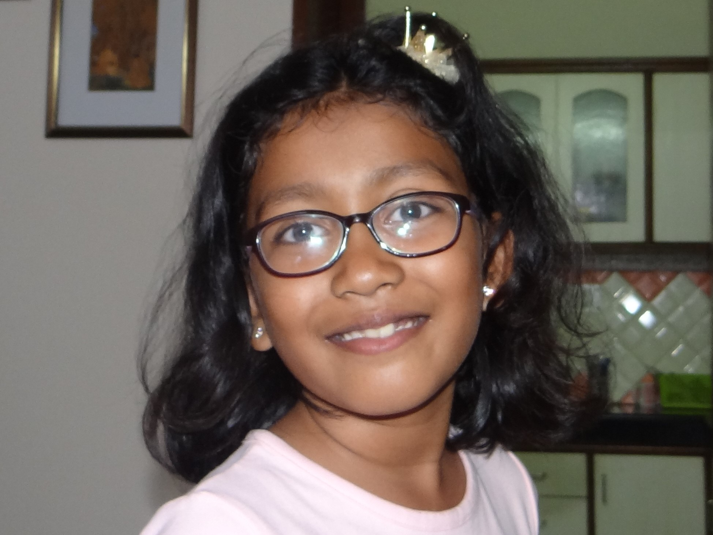

{:height="200px"}

Hello Guest, Welcome! 

My name is Pakhi, I am 9 years old, class IV student. My hobbies are building Lego, Making Craft, Cycling and Cricket. I love to play outdoors.

I am learning to write computer programs from [my father](https://pradeeppant.com/). I love to spend time on scratch. I like scratch because I can play games. The best part in scratch is that all the games are made of Programming. In scratch we can make the games as well .

I will take you through my learning ride.

Some of the sites I use for learning and fun.

* [Scrath](https://scratch.mit.edu/)
* [Code.org](http://www.code.org/)
* [flowgorithm](http://www.flowgorithm.org/)
* [Khan Academy](https://www.khanacademy.org/)
* [Chess](https://www.chesskid.com/)
* [ABCYA](https://www.abcya.com/)
* [Lumosity](https://www.lumosity.com/en/)
* [Maths is Fun](https://www.mathsisfun.com/index.htm)
* [LEGO](https://www.lego.com/en-us/kids)
* [Kids can Code](https://www.youtube.com/channel/UCNaPQ5uLX5iIEHUCLmfAgKg)
* [Tux Paint](http://www.tuxpaint.org/)
* Learning HTML and CSS to make web page

Thanks for visiting.

Aug, 2020

